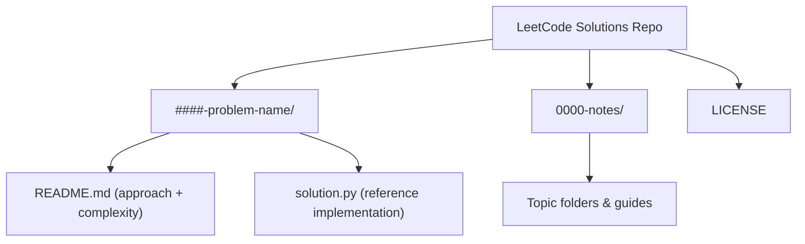

# LeetCode Solutions Repository

Curated, well-documented **Python 3** solutions for a growing set of LeetCode problems. Every problem folder contains:
- `README.md` with a concise explanation and complexity notes.
- `solution.py` with a clean, runnable implementation.

Use this repo as a reusable algorithm notebook or a quick refresher before interviews.

---

## Repository structure
- `####-problem-name/` — individual problems; run `python solution.py` to execute the reference implementation.
- `0000-notes/` — reusable study notes and templates grouped by topic.
- `LICENSE` — repository license details.

### Repository map

### Notes library highlights
- **How to think**: reading prompts, choosing algorithms, and avoiding common mistakes.
- **Core patterns**: arrays, hashing, two pointers, sliding window, binary search, prefix sum, greedy, and dynamic programming.
- **Practice helpers**: quick references for frequency counting, bucket techniques, interval scheduling, and more.

#### Notes index
- **00-how-to-think**: [how to read problems](0000-notes/00-how-to-think/how-to-read-problems.md), [how to choose algorithms](0000-notes/00-how-to-think/how-to-choose-algorithms.md), [common mistakes](0000-notes/00-how-to-think/common-mistakes.md)
- **01-array**: [array basics](0000-notes/01-array/array-basics.md)
- **02-hash-table**: [hashing basics](0000-notes/02-hash-table/hashing-basics.md), [frequency count](0000-notes/02-hash-table/frequency-count.md), [bucket technique](0000-notes/02-hash-table/bucket-technique.md)
- **03-two-pointers**: [two-pointers basics](0000-notes/03-two-pointers/two-pointers-basics.md)
- **04-sliding-window**: [fixed window](0000-notes/04-sliding-window/sliding-window-fixed.md), [variable window](0000-notes/04-sliding-window/sliding-window-variable.md)
- **05-binary-search**: [binary search on array](0000-notes/05-binary-search/binary-search-on-array.md), [binary search on answer](0000-notes/05-binary-search/binary-search-on-answer.md)
- **06-prefix-sum**: [prefix sum](0000-notes/06-prefix-sum/prefix-sum.md), [difference array](0000-notes/06-prefix-sum/difference-array.md)
- **07-greedy**: [greedy thinking](0000-notes/07-greedy/greedy-thinking.md), [interval greedy](0000-notes/07-greedy/interval-greedy.md)
- **08-dynamic-programming**: [introduction](0000-notes/08-dynamic-programming/dp-introduction.md), [state design](0000-notes/08-dynamic-programming/dp-state-design.md), [dp on array](0000-notes/08-dynamic-programming/dp-on-array.md), [dp on strings](0000-notes/08-dynamic-programming/dp-on-strings.md), [summary](0000-notes/08-dynamic-programming/summary.md)
- **09-graph**: [graph basics](0000-notes/09-graph/graph-basics.md), [BFS](0000-notes/09-graph/bfs.md), [union find](0000-notes/09-graph/union-find.md), [topological sort](0000-notes/09-graph/topological-sort.md), [shortest path (Dijkstra)](0000-notes/09-graph/shortest-path-dijkstra.md)
- **10-how-to-choose-algorithm**: [algorithm selection guide](0000-notes/10-how-to-choose-algorithm/algorithm-selection-guide.md)
- **11-pattern-library**: [core patterns](0000-notes/11-pattern-library/core-patterns.md)

> 每篇笔记都有对应的中文版本，文件名以 `-zh.md` 结尾。

---

## Quick start
1. **Clone**: `git clone <repo-url>`
2. **Navigate** to a problem directory, e.g. `cd 0001-two-sum`.
3. **Run** the solution: `python solution.py`
4. **Read** the accompanying `README.md` for the approach, complexity, and edge cases.

> Tip: The folder naming convention is `<problem-id>-<kebab-case-title>` so you can jump directly to the problem you want to review.

---

## Solution format
Each problem folder follows a consistent template so you can skim or reuse ideas quickly.

- **`README.md`** contains the problem summary, key insight, approach, complexity, and a short takeaway.
- **`solution.py`** is a runnable reference solution with type hints and inline notes for tricky steps.

If you want to add a new problem, start by copying any existing folder and updating the metadata.

---

## Quick checks
There is no centralized test runner yet, but you can sanity-check a solution with:

- `python solution.py` (runs the sample input if present)
- `python -m py_compile solution.py` (verifies syntax)

---

## Problem catalog
A topic-focused index of all solutions currently in the repository.

| ID | Problem | Topics |
| --- | --- | --- |
| 0001 | [Two Sum](0001-two-sum/) | Array; Hash Table |
| 0002 | [Add Two Numbers](0002-add-two-numbers/) | Linked List; Math |
| 0003 | [Longest Substring Without Repeating Characters](0003-longest-substring-without-repeating-characters/) | Sliding Window; Hash Map |
| 0004 | [Median of Two Sorted Arrays](0004-median-of-two-sorted-arrays/) | Binary Search; Divide & Conquer |
| 0005 | [Longest Palindromic Substring](0005-longest-palindromic-substring/) | String; Expand Around Center; Dynamic Programming |
| 0006 | [Zigzag Conversion](0006-zigzag-conversion/) | String; Simulation |
| 0007 | [Reverse Integer](0007-reverse-integer/) | Math; Overflow Handling |
| 0008 | [String to Integer (atoi)](0008-string-to-integer-atoi/) | String; Parsing |
| 0009 | [Palindrome Number](0009-palindrome-number/) | Math; Two Pointers |
| 0010 | [Regular Expression Matching](0010-regular-expression-matching/) | Dynamic Programming; Pattern Matching |
| 0011 | [Container With Most Water](0011-container-with-most-water/) | Array; Two Pointers |
| 0012 | [Integer to Roman](0012-integer-to-roman/) | Math; Mapping |
| 0013 | [Roman to Integer](0013-roman-to-integer/) | Math; Mapping |
| 0026 | [Remove Duplicates from Sorted Array](0026-remove-duplicates-from-sorted-array/) | Array; Two Pointers |
| 0027 | [Remove Element](0027-remove-element/) | Array; Two Pointers |
| 0028 | [Find the Index of the First Occurrence in a String](0028-find-the-index-of-the-first-occurrence-in-a-string/) | String; Two Pointers |
| 0049 | [Group Anagrams](0049-group-anagrams/) | Hash Table; Sorting |
| 0066 | [Plus One](0066-plus-one/) | Array; Simulation |
| 0085 | [Maximal Rectangle](0085-maximal-rectangle/) | Dynamic Programming; Stack; Monotonic Stack |
| 0121 | [Best Time to Buy and Sell Stock](0121-best-time-to-buy-and-sell-stock/) | Array; Greedy |
| 0164 | [Maximum Gap](0164-maximum-gap/) | Bucket Sort; Sorting |
| 0220 | [Contains Duplicate III](0220-contains-duplicate-iii/) | Sliding Window; Bucket Sort |
| 0242 | [Valid Anagram](0242-valid-anagram/) | Hash Table; Sorting |
| 0347 | [Top K Frequent Elements](0347-top-k-frequent-elements/) | Heap; Hash Table |
| 0451 | [Sort Characters by Frequency](0451-sort-characters-by-frequency/) | Heap; Hash Table |
| 0679 | [24 Game](0679-24-game/) | Backtracking; DFS; Math |
| 0692 | [Top K Frequent Words](0692-top-k-frequent-words/) | Heap; Sorting |
| 0712 | [Minimum ASCII Delete Sum for Two Strings](0712-minimum-ascii-delete-sum-for-two-strings/) | Dynamic Programming; String |
| 0756 | [Pyramid Transition Matrix](0756-pyramid-transition-matrix/) | Graph; DFS |
| 0840 | [Magic Squares in Grid](0840-magic-squares-in-grid/) | Array; Enumeration |
| 0865 | [Smallest Subtree with all the Deepest Nodes](0865-smallest-subtree-with-all-the-deepest-nodes/) | Tree; Depth-First Search; Binary Tree; Lowest Common Ancestor |
| 0912 | [Sort an Array](0912-sort-an-array/) | Sorting; Divide & Conquer |
| 0944 | [Delete Columns to Make Sorted](0944-delete-columns-to-make-sorted/) | Greedy; String |
| 0955 | [Delete Columns to Make Sorted II](0955-delete-columns-to-make-sorted-ii/) | Greedy; String |
| 0960 | [Delete Columns to Make Sorted III](0960-delete-columns-to-make-sorted-iii/) | Dynamic Programming; String |
| 0961 | [N-Repeated Element in Size 2N Array](0961-n-repeated-element-in-size-2n-array/) | Hash Table; Counting |
| 1161 | [Maximum Level of a Binary Tree](1161-maximum-level-of-a-binary-tree/) | Tree; BFS |
| 1266 | [Minimum Time Visiting All Points](1266-minimum-time-visiting-all-points/) | Geometry; Greedy; Math |
| 1339 | [Maximum Product of Splitted Binary Tree](1339-maximum-product-of-splitted-binary-tree/) | Tree; Depth-First Search; Binary Tree; Math |
| 1351 | [Count Negative Numbers in a Sorted Matrix](1351-count-negative-numbers-in-a-sorted-matrix/) | Matrix; Binary Search |
| 1390 | [Four Divisors](1390-four-divisors/) | Math; Number Theory |
| 1411 | [Number of Ways to Paint N x 3 Grid](1411-number-of-ways-to-pair-nx3-grid/) | Dynamic Programming; Combinatorics |
| 1458 | [Max Dot Product of Two Subsequences](1458-max-dot-product-of-two-subsequence/) | Dynamic Programming; Array; Subsequence |
| 1523 | [Count Odd Numbers in an Interval Range](1523-count-odd-numbers-in-an-interval-range/) | Math |
| 1590 | [Make Sum Divisible by P](1590-make-sum-divisible-by-p/) | Prefix Sum; Hash Map; Modular Arithmetic |
| 1895 | [Largest Magic Square](1895-largest-magic-square/) | Prefix Sum; Matrix; Enumeration |
| 1925 | [Count Square Sum Triples](1925-count-square-sum-triples/) | Math; Number Theory |
| 1970 | [Last Day Where You Can Still Cross](1970-last-day-where-you-can-still-cross/) | Binary Search; BFS/Union Find |
| 1975 | [Maximum Matrix Sum](1975-maximum-matrix-sum/) | Greedy; Matrix |
| 2047 | [Find the Largest Area of Square Inside Two Rectangles](2047-find-the-largest-area-of-square-inside-two-rectangles/) | Geometry; Brute Force; Enumeration |
| 2054 | [Two Best Non-Overlapping Events](2054-two-best-non-overlapping-events/) | Dynamic Programming; Sorting |
| 2092 | [Find All People With Secret](2092-final-all-people-with-secret/) | Graph; Union Find |
| 2110 | [Number of Smooth Descent Periods of a Stock](2110-number-of-smooth-descent-periods-of-a-stock/) | Sliding Window; Counting |
| 2141 | [Maximum Running Time of N Computers](2141-maximum-running-time-of-n-computers/) | Binary Search; Greedy |
| 2147 | [Number of Ways to Divide a Long Corridor](2147-number-of-ways-to-divide-a-long-corridor/) | Dynamic Programming; Combinatorics |
| 2211 | [Count Collisions on a Road](2211-count-collisions-on-a-road/) | Simulation; Stack |
| 2273 | [Find Resultant Array After Removing Anagrams](2273-find-resultant-array-after-removing-anagrams/) | String; Stack |
| 2343 | [Query Kth Smallest Trimmed Number](2343-query-kth-smallest-trimmed-number/) | Sorting; Priority Queue |
| 2402 | [Meeting Rooms III](2402-meeting-rooms-iii/) | Priority Queue; Scheduling |
| 2435 | [Paths in Matrix Whose Sum Is Divisible by K](2435-paths-in-matrix-divisible-by-k/) | Dynamic Programming; Prefix Sum |
| 2483 | [Minimum Penalty for a Shop](2483-minimum-penalty-for-shop/) | Prefix Sum; Enumeration |
| 2872 | [Maximum Number of K-Divisible Components](2872-maximum-number-of-k-divisible-components/) | Tree; DFS; Greedy; Graph |
| 2943 | [Maximize Area of Square Hole in Grid](2943-maximize-area-of-square-hole-in-grid/) | Greedy; Geometry; Sorting |
| 2975 | [Maximum Square Area by Removing Fences From a Field](2975-maximum-square-area-by-removing-fences-from-a-field/) | Geometry; Hash Set; Greedy |
| 3074 | [Apple Redistribution into Boxes](3074-apple-redistribution-into-boxes/) | Greedy; Sorting |
| 3075 | [Maximize Happiness of Children](3075-maximize-happiness-of-children/) | Greedy; Sorting |
| 3381 | [Maximum Subarray Sum With Length Divisible by K](3381-maximum-subarray-sum-with-length-divisible-by-k/) | Prefix Sum; Hash Map |
| 3432 | [Count Partitions with Even Sum Difference](3432-count-partitions-with-even-sum-difference/) | Prefix Sum; Math |
| 3433 | [Count Mentions Per User](3433-count-mentions-per-user/) | Simulation; Hash Table |
| 3453 | [Separate Squares I](3453-Separate-squares-I/) | Binary Search; Geometry; Prefix Area |
| 3454 | [Separate Squares II](3454-separate-squares-ii/) | Sweep Line; Segment Tree; Geometry; Binary Search |
| 3512 | [Minimum Operations to Make Array Sum Divisible by K](3512-minimum-operations-to-make-array-sum-divisible-by-k/) | Math; Greedy; Modular Arithmetic |
| 3531 | [Count Covered Buildings](3531-count-covered-buildings/) | Geometry; Prefix Min/Max |
| 3562 | [Maximum Profit from Trading Stocks with Discounts](3562-maximum-profit-from-trading-stocks-with-discounts/) | Tree DP; Knapsack |
| 3573 | [Best Time to Buy and Sell Stock V](3573-best-time-to-buy-and-sell-stock-v/) | Dynamic Programming; State Machine |
| 3577 | [Count the Number of Computer Unlocking Permutations](3577-count-the-number-of-computer-unlocking-permutations/) | Sorting; Feasibility Check |
| 3578 | [Count Partitions With Max-Min Difference at Most K](3578-count-partitions-with-max-min-difference-at-most-k/) | Sliding Window; Dynamic Programming |
| 3583 | [Count Special Triplets](3583-count-special-triplets/) | Hash Map; Prefix/Suffix Counting |
| 3606 | [Coupon Code Validator](3606-coupon-code-validator/) | String; Simulation |
| 3623 | [Count Number of Trapezoids I](3623-count-number-of-trapezoids-i/) | Array; Geometry |
| 3625 | [Count Number of Trapezoids II](3625-count-number-of-trapezoids-ii/) | Array; Geometry |
| 3652 | [Best Time to Buy and Sell Stock using Strategy](3652-best-time-to-buy-and-sell-stock-using-strategy/) | Prefix Sum; Sliding Window |

---

## Contributing
- Follow the existing folder naming pattern (`####-title-in-kebab-case`).
- Provide both `README.md` (approach & complexity) and `solution.py` (idiomatic Python).
- Keep explanations concise and prefer standard library solutions unless an external dependency is necessary.

Happy coding and studying! 🚀
